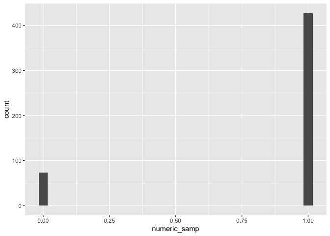

Practice - Building Blocks
================
2025-02-26

**Learning assessment:** Write a named code chunk that creates a
dataframe comprised of: a numeric variable containing a random sample of
size 500 from a normal variable with mean 1; a logical vector indicating
whether each sampled value is greater than zero; and a numeric vector
containing the absolute value of each element. Then, produce a histogram
of the absolute value variable just created. Add an inline summary
giving the median value rounded to two decimal places.

<!-- -->

The median of the variable containing absolute value is 1.05.

**Learning assessment:** After the previous code chunk, write a bullet
list given the mean, median, and standard deviation of the original
random sample.

- The mean of the random sample is: 1.0317565.
- The median of the random sample is: 1.0496895.
- The standard deviation of the random sample is: 0.987799.
